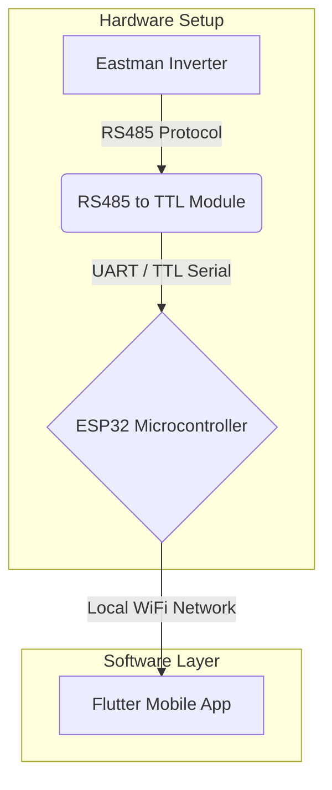
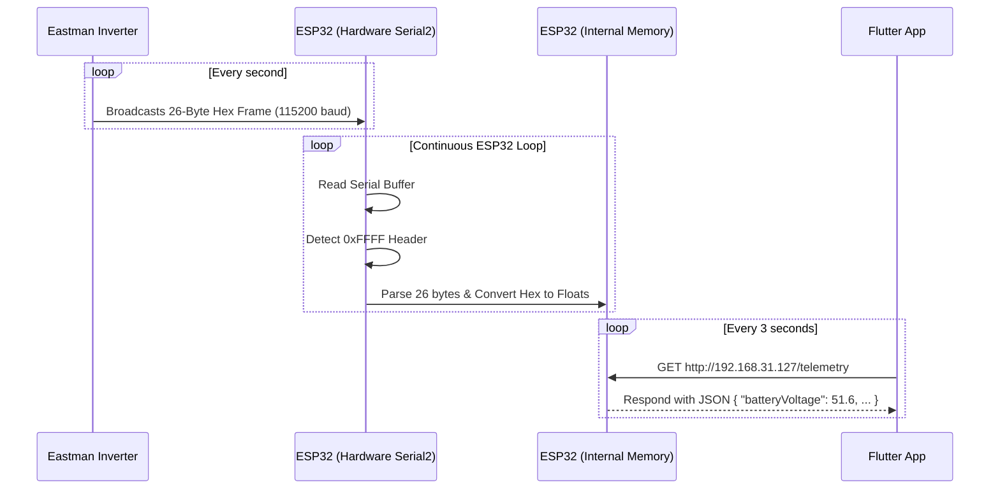

# System Design & Architecture

This document explains the end-to-end architecture of the Eastman Inverter Monitoring System.

## High-Level Architecture Flow

The system consists of four main layers: The Source (Inverter), The Bridge (Hardware), The Server (ESP32), and The Client (Flutter App).

## Physical Wiring & Connections

### 1. Inverter to RS485 Module
The inverter exposes an RS485 port (often a 4-pin circular connector or RJ45). RS485 uses differential signaling over two wires, usually labeled `A` and `B`.
* **Inverter Pin 1 (A/D+)** connected to **RS485 Module Pin A**
* **Inverter Pin 2 (B/D-)** connected to **RS485 Module Pin B**

### 2. RS485 Module to ESP32
The RS485 module translates the robust RS485 voltages into TTL logic levels (0-3.3V) that the ESP32 can safely read.
* **VCC:** Connected to ESP32 `VIN` or `5V` (powered by the mobile charger).
* **GND:** Connected to ESP32 `GND`.
* **RXD (Receiver):** Connected to ESP32 `Pin 27` (Software configured as RX for Serial2).
* **TXD (Transmitter):** Connected to ESP32 `Pin 26`. *(Note: In our final passive-listener design, the TXD line is kept high and unused since we don't send data back).*

### 3. Power Supply
* The ESP32 is powered via its micro-USB port using a standard **OnePlus 5V Mobile Wall Charger**. 
* The ESP32's onboard voltage regulator steps this 5V down to 3.3V for its own chip, while passing the 5V directly to the RS485 module via the `VIN` pin.

## Software Data Flow

## How the Parsing Works

1. **Header Detection:** The ESP32 reads bytes one by one until it sees `0xFF` followed immediately by another `0xFF`. This marks the start of a new data package.
2. **Buffer Collection:** It then captures the next 24 bytes, filling a 26-byte array.
3. **Bit-shifting:** The data is sent in two-byte pairs (16-bit integers). The ESP32 combines them using bitwise operations. For example, if the Battery Voltage bytes are `0x13` and `0x33`:
   * Combine: `0x1333` (which is `4915` in decimal).
   * Scale: The manual states voltage is scaled by 100, so `4915 / 100 = 49.15 Volts`.
4. **JSON Serving:** These decoded values are stored in a struct. When the Flutter app makes an HTTP GET request, the ESP32 formats this struct into a JSON string and sends it over the local network.
